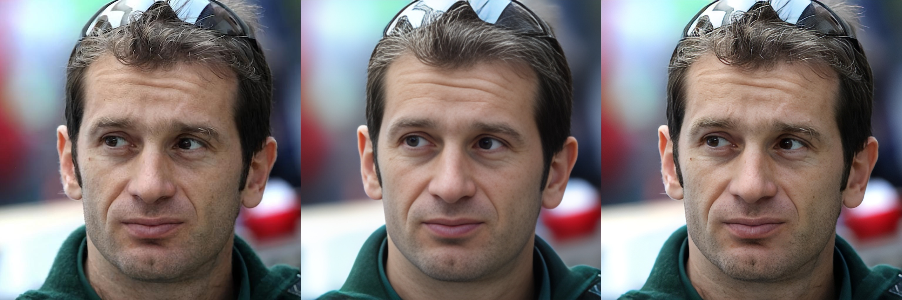
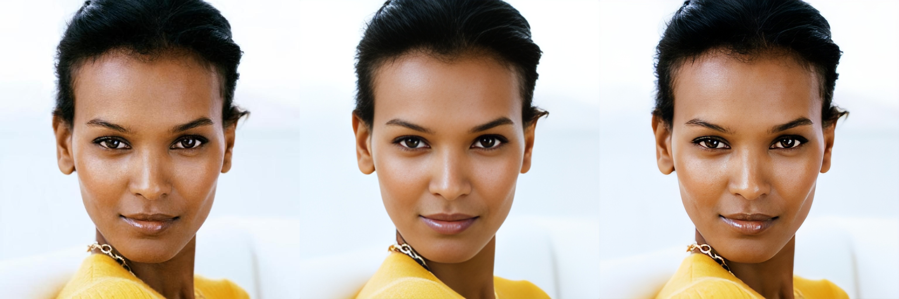

# GFPGAN-1024
You can train  finetune your GFPGAN-1024 model with your own dataset!
inputs:512 -> outputs:1024
## My results
original | gfpgan | gfgan-1024




## ENVIRONMENT 
```pip install -r requirements.txt```

## DATASET
1. prepare ffhq-1024 data 
2. Collect your own pictures and align
3. Do image supersession through open APIs like [here](https://vision.aliyun.com/experience/detail?spm=a2cvz.27717767.J_7524944390.35.66cd28d0NQLXfu&tagName=facebody&children=EnhanceFace)
4. get facial landmark to enhance eyes and mouth
    1. ```git clone git@github.com:LeslieZhoa/LVT.git```
    2. download model 
    3. change [LVT file](process/get_roi.py#L2)
    4. change [landmark model file](process/get_roi.py#L26)
    5. change [image root](process/get_roi.py#L112)
    6. change [save root](process/get_roi.py#L115)
    7. run ```cd process; python get_roi.py```
## Download
refer [GFPGAN](https://github.com/TencentARC/GFPGAN) to download<br> 
1. GFPGANv1.4.pth
2. GFPGANv1_net_d_left_eye.pth
3. GFPGANv1_net_d_mouth.pth
4. GFPGANv1_net_d_right_eye.pth
5. arcface_resnet18.pth
6. get vgg model [here](https://github.com/LeslieZhoa/DCT-NET.Pytorch/releases/download/v0.0/vgg19-dcbb9e9d.pth) 
7. get discriminator [here](https://github.com/LeslieZhoa/GFPGAN-1024/releases/download/untagged-7fadd91b517da1810e55/d.pth) which is transformed from [original stylegan2](https://github.com/NVlabs/stylegan2)

put these model into pretrained_models

## Train
### config change
change dataset path  in model/config.py
```
self.img_root -> ffhq data root
self.train_hq_root -> your own 1024 data root
self.train_lq_root -> your own lq data root
self.train_lmk_base -> train lmk by get_roi.py
self.val_lmk_base -> val lmk by get_roi.py
self.val_lq_root -> val lq data root
self.val_hq_root -> val hq data root
```
### stage 1: train decoder
set self.mode = 'decoder' in model/config.py<br>
train util you think it is ok.
### stage 2: train encoder
set self.mode = 'encoder' and self.pretrain_path from stage 1 in model/config.py<br>
train util you think it is ok.
### stage 3: train all net
set self.mode = 'encoder' and self.pretrain_path from stage 2 in model/config.py<br>
use early stop.

### run the code
stage 1 && stage 2 -> ```python train.py  --batch_size 2 --scratch --dist``` <br>
stage 3 -> ```python train.py  --batch_size 2 --early_stop --dist```<br>
Support multi node multi gpus training

## convert torch script model
Can multi batch<br>
```python utils/convert_pt.py```


   
    
